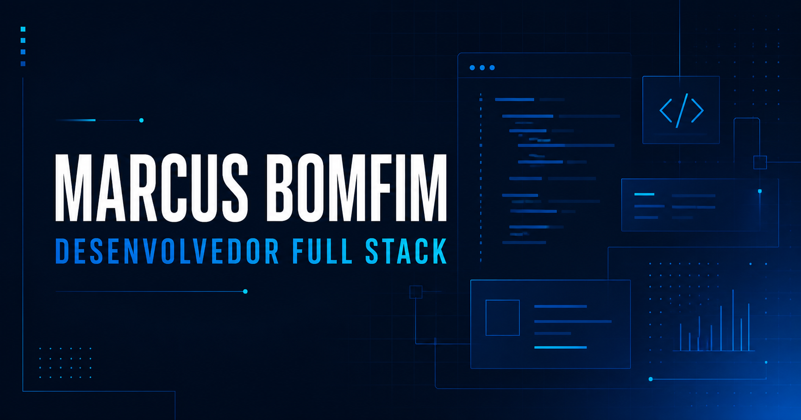

# Portfólio — Marcus Bomfim

Portfólio profissional criado para apresentar minha trajetória, competências e projetos como desenvolvedor Full Stack. A página reúne estudos de caso com contexto, desafios, soluções e tecnologias utilizadas em aplicações voltadas a problemas reais.

**Acesse o projeto:** [marcus-bomfim-portfolio.vercel.app](https://marcus-bomfim-portfolio.vercel.app/)



## Conteúdo

- Apresentação profissional e objetivo de carreira
- Competências de front-end, back-end, dados e ferramentas
- Certificados AWS e Cisco com documentos disponíveis para visualização
- Estudos de caso dos projetos AsiaLogService, Porto Agenda e Nexo
- Captura real do AsiaLogService conectado à API e ao SQL Server
- Trajetória profissional e competências transferíveis
- Links para LinkedIn, GitHub, currículo e contato por e-mail
- Alternância entre temas claro e escuro

## Tecnologias

- React
- TypeScript
- Vite
- CSS
- Lucide React

## Qualidade e acessibilidade

O projeto inclui navegação responsiva, suporte a teclado, link para pular ao conteúdo, foco visível, respeito à preferência por movimento reduzido e contraste adaptado aos temas claro e escuro.

Também foram configurados metadados para mecanismos de busca e compartilhamento em redes sociais, dados estruturados e uma imagem própria para prévia de links.

## Estrutura principal

```text
src/
├── components/
│   ├── layout/
│   └── ui/
├── data/
├── sections/
├── styles/
└── types/
```

## Como executar

É necessário ter o Node.js instalado.

```powershell
git clone https://github.com/MarcusBomfim/Portfolio.git
cd Portfolio
npm.cmd install
npm.cmd run dev
```

Abra o endereço informado pelo Vite no terminal.

## Comandos disponíveis

```powershell
# Ambiente de desenvolvimento
npm.cmd run dev

# Verificação de código
npm.cmd run lint

# Compilação para produção
npm.cmd run build

# Prévia da versão compilada
npm.cmd run preview

# Lint e build em sequência
npm.cmd run check
```

Os arquivos de produção são gerados na pasta `dist`.

## Publicação na Vercel

A forma recomendada de publicar este projeto é conectar o repositório do GitHub à Vercel. Assim, cada atualização enviada para a branch `main` gera automaticamente uma nova versão de produção.

1. Envie as alterações para o GitHub.
2. Acesse [vercel.com](https://vercel.com/) e entre com sua conta do GitHub.
3. Selecione **Add New > Project**.
4. Importe o repositório `MarcusBomfim/Portfolio`.
5. Confirme as configurações detectadas:
   - Framework Preset: `Vite`
   - Root Directory: `./`
   - Build Command: `npm run build`
   - Output Directory: `dist`
6. Selecione **Deploy**.

Este portfólio não utiliza variáveis de ambiente. A versão de produção está disponível em [marcus-bomfim-portfolio.vercel.app](https://marcus-bomfim-portfolio.vercel.app/).

Branches diferentes da `main` podem ser utilizadas para gerar versões de prévia antes de publicar mudanças em produção.

## Autor

**Marcus Bomfim** — Desenvolvedor Full Stack

- [GitHub](https://github.com/MarcusBomfim)
- [E-mail](mailto:marcusbomfimm@gmail.com)
